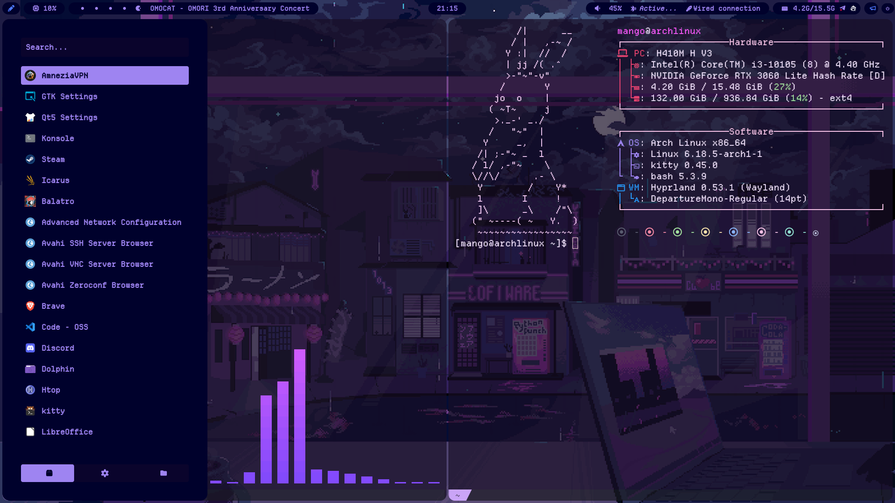

# Purple lofi night
My dot files and additional instructions for ricing arch on hyprland



## Main packages
* Window Manager: [hyprland](https://hypr.land/)
* File manager: [pcmanfm](https://wiki.archlinux.org/title/PCManFM)
* Panel: [waybar](https://github.com/Alexays/Waybar)
* Shell: [KiTTY](https://sw.kovidgoyal.net/kitty/)
* Application launcher: [rofi](https://github.com/davatorium/rofi)
* Notification center: [swaync](https://github.com/ErikReider/SwayNotificationCenter)
* Main font: [Departure Mono](https://departuremono.com/)
* Animated desktop: [awww](https://codeberg.org/LGFae/awww)
* Notetaker: [obsidian](https://obsidian.md/)

## Additional packages
* GTK settings: [nwg-look](https://github.com/nwg-piotr/nwg-look)
* Color picker: [hyprpicker](https://github.com/hyprwm/hyprpicker)
* Lockscreen: [hyprlock](https://github.com/hyprwm/hyprlock)
* Screenshots: [hyprshot](https://github.com/Gustash/Hyprshot) (Hotkey configured as ```SUPER+P``` in ```/hypr/config/binds.conf```)
* AUR helper, some packages require it for easier installation: [yay](https://github.com/Jguer/yay)
* GTK themes: catppuccin-gtk-theme-mocha ([AUR](https://aur.archlinux.org/packages/catppuccin-gtk-theme-mocha))
* Cursor theme: [catppuccin-cursors-mocha](https://github.com/catppuccin/cursors)

## Structure
```
./.config/hypr # Hyprland structure
├── config
│   ├── animations.conf
│   ├── binds.conf
│   ├── env.conf
│   ├── settings.conf
│   ├── startup.conf
│   └── window_rules.conf
├── hyprland.conf
├── hyprlock.conf
└── hyprtoolkit.conf

./.config/waybar # Waybar configuration files
├── config.jsonc
├── context # Context menus
│   ├── ctlcenter.xml
│   └── network.xml
├── css
│   ├── colors.css
│   └── style.css # Main css
├── layouts
│   ├── with_music.jsonc   # Layout with mpris at left
│   └── with_window.jsonc  # Layout with current window title  
├── modules.jsonc # Modules configuration
└── style.css
```


## Instructions
### Pacman
```
sudo pacman -S pcmanfm nwg-look hyprpicker hyprshot hyprlock obsidian
```
### yay
```
yay -S catppuccin-cursors-mocha
```

### Building AUR packages
Using [catppuccin-gtk-theme-mocha](https://aur.archlinux.org/packages/catppuccin-gtk-theme-mocha) package as an example for building packages from Arch User Repository:
1. Git clone. The link is copied from *"Git Clone URL:"*
```
git clone https://aur.archlinux.org/catppuccin-gtk-theme-mocha.git
```
2. Move to the cloned directory
```
cd catppuccin-gtk-theme-mocha
```
3. Make package with PKGBUILD
```
makepkg -si
```
### Adding a keyboard layout
In ```./config/hypr/config/settings.conf``` find ```input``` category and add (or edit):
```
    kb_layout = us,ru
    kb_options = grp:win_space_toggle
```
First line adds russian as a second layout. Toggle hotkey is configured in the second line as ```SUPER + SPACE```
### Hyprlock as "login" screen
1. [Enable autologin](https://wiki.archlinux.org/title/LightDM#Enabling_autologin) in your greeter. Below is the instruction for my LightDM, sourced from ArchWiki:
```
sudo nano /etc/lightdm/lightdm.conf
```
2. Edit the LightDM configuration file and ensure these lines are uncommented and correctly configured:
```
[Seat:*]
autologin-user=<username>
autologin-user-timeout=0
autologin-session=hyprland
```
3. You must be part of the ```autologin``` group to be able to login automatically without entering your password:
```
groupadd -r autologin
gpasswd -a <username> autologin
```
4. Ensure that the hyprland startup config includes hyprlock. In ```.config/hypr/config/startup.conf``` add:
```
exec-once = hyprlock
```
### Obsidian
>Instead of purchasing a vault, I sync vaults via GitHub.
1. Configure auto-pull on Arch, hyprland. In ```.config/hypr/config/startup.conf``` add:
```
exec-once = hyprctl dispatch exec "cd ~/Notes && git pull"
```